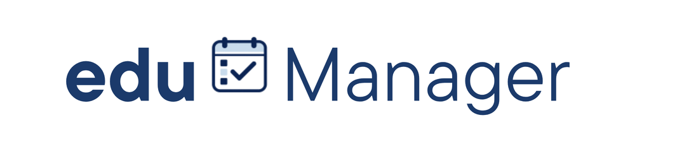
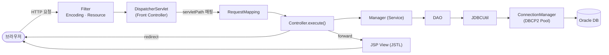
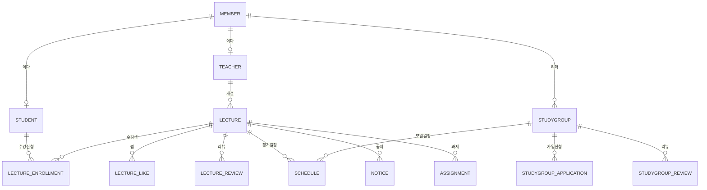

<div align="center">



# EduManager

**강의와 스터디를 한 곳에서 — 강사·학생을 위한 교육 관리 플랫폼**

강사는 강의를 개설하고 일정·공지·과제를 관리하며, 학생은 강의를 신청하고 스터디 그룹을 만들어 함께 공부합니다.

<br/>


</div>

<br/>

## 📖 목차

1. [프로젝트 소개](#-프로젝트-소개)
2. [팀원](#-팀원)
3. [주요 기능](#-주요-기능)
4. [기술 스택](#-기술-스택)
5. [시스템 아키텍처](#-시스템-아키텍처)
6. [디렉터리 구조](#-디렉터리-구조)
7. [ERD](#-erd)
8. [실행 방법](#-실행-방법)
9. [트러블 슈팅](#-트러블-슈팅)
10. [개발 컨벤션](#-개발-컨벤션)

<br/>

## 🎓 프로젝트 소개

> **데이터베이스 프로그래밍** 교과목 팀 프로젝트

**EduManager**는 강의·스터디 운영에 필요한 흐름을 하나의 서비스로 묶은 웹 애플리케이션입니다.
흩어져 있던 "강의 모집 → 수강 신청 → 일정/공지/과제 관리 → 스터디 모임"을 한 플랫폼에서 처리하도록 설계했습니다.

- **강사**는 강의를 개설하고 정기 일정·공지·과제를 등록합니다.
- **학생**은 관심 강의를 찾아 수강 신청하고, 직접 스터디 그룹을 만들어 팀원을 모집합니다.
- 모든 일정은 **메인 캘린더**에서 통합으로 확인합니다.

스프링/마이바티스 같은 프레임워크 없이 **Servlet·JSP·JDBC만으로 MVC 구조를 직접 구현**하여, 프런트 컨트롤러·커넥션 풀·트랜잭션·파일(BLOB) 저장 등 웹 백엔드의 동작 원리를 밑바닥부터 다룬 것이 특징입니다.

<br/>

## 👥 팀원

| <div align="center">이름</div> | <div align="center">담당</div> | <div align="center">GitHub</div> |
| :---: | :--- | :---: |
| 팀원 1 | 회원·인증, 마이페이지 | [@username](https://github.com/) |
| 팀원 2 | 강의(개설·일정·공지·과제) | [@username](https://github.com/) |
| 팀원 3 | 스터디 그룹·가입 신청 | [@username](https://github.com/) |
| 팀원 4 | 메인 캘린더·공통/디자인 | [@username](https://github.com/) |

> 팀원 정보는 실제 정보로 채워 주세요.

<br/>

## ✨ 주요 기능

### 👤 회원 · 인증
- 학생 / 강사 **역할 기반 회원가입** (단계별 입력)
- 로그인 / 로그아웃, 세션 기반 인증 및 권한별 접근 제어
- **프로필 사진 업로드** (Oracle BLOB 저장 → `/image` 로 스트리밍 서빙)
- 아이디 **중복 확인**(AJAX 인라인 검사), 내 정보 수정, 회원 탈퇴

### 📚 강의 (강사 / 학생)
- 강사: 강의 **개설·수정**, 정기 수업 일정·**공지·과제** 등록, 강의 대표 사진
- 학생: 강의 목록·상세 조회, **수강 신청**, **찜(좋아요)**, **리뷰** 작성
- 강사 권한 검증 (강의 개설은 강사만 가능)

### 👥 스터디 그룹
- 스터디 **개설·수정**, 모집 인원·정기 모임 요일 설정
- **가입 신청 → 리더의 수락 / 거절** 흐름
- 스터디 공지·과제·일정, 찜, 리뷰

### 🗓 메인 · 마이페이지
- **통합 일정 캘린더** — 수업·스터디·과제·공지를 한 화면에서
- 마이페이지: 내 정보 · 내 강의 · 내 스터디 · 찜 목록

> 🖼 **화면 미리보기**: 실제 캡처 이미지를 `docs/` 에 추가해 이 자리에 넣어 주세요.

<br/>

## 🛠 기술 스택

| 구분 | 기술 |
| :--- | :--- |
| **Language** | Java 17 |
| **View** | JSP 2.3, JSTL 1.2 |
| **Web** | Servlet 4.0 (Custom MVC · Front Controller) |
| **DB** | Oracle Database, JDBC, Apache Commons **DBCP2** (커넥션 풀) |
| **File** | Multipart (`@MultipartConfig`), Commons FileUpload / IO, **BLOB** |
| **Etc.** | Jackson(JSON), Logback(로깅), JUnit |
| **Build / Run** | Maven (WAR), Apache Tomcat 9 |

> 프레임워크(Spring/MyBatis) 미사용 — 순수 Servlet·JSP·JDBC 기반.

<br/>

## 🏗 시스템 아키텍처

프런트 컨트롤러 패턴 기반의 **계층형 MVC** 구조입니다.



**요청 처리 흐름**
1. 모든 요청은 `Filter`(인코딩·정적 리소스)를 거쳐 `DispatcherServlet` 으로 진입
2. `RequestMapping` 이 URL → `Controller` 매핑 (없으면 **404**)
3. `Controller` 가 `Manager`(서비스) → `DAO` → `JDBCUtil` → 커넥션 풀 순으로 DB 처리
4. 결과에 따라 JSP **forward** 또는 **redirect** 반환
5. 작업 실패 시 세션 `flashError` 에 메시지를 담아 **PRG(Post-Redirect-Get)** 로 사용자에게 1회성 알림

<br/>

## 🗂 디렉터리 구조

```
EduManager
├── db/                                # DB 스키마 (IMAGE 등)
├── pom.xml                            # Maven 의존성 / 빌드
└── src/main
    ├── java
    │   ├── controller                 # 프런트 컨트롤러 + 도메인별 Controller
    │   │   ├── DispatcherServlet.java #  └ 진입점(Front Controller)
    │   │   ├── RequestMapping.java    #  └ URL ↔ Controller 매핑
    │   │   └── lecture / study / studyGroup / member / mypage / main
    │   ├── filter                     # EncodingFilter, ResourceFilter
    │   └── model
    │       ├── domain                 # 도메인 객체(Member, Lecture, StudyGroup …)
    │       ├── service                # Manager(비즈니스 로직, 싱글톤)
    │       └── dao                    # DAO + JDBCUtil + ConnectionManager
    ├── resources                      # context.properties(DB 접속) 등
    └── webapp
        ├── css / js / images          # 정적 리소스 (네이비 디자인 시스템)
        └── WEB-INF
            ├── web.xml                # 서블릿/필터/에러 페이지 매핑
            ├── error.jsp              # 커스텀 404/500 페이지
            ├── navigation/            # 공통 네비게이션(+ flash 배너)
            └── lecture / study / member / mypage / main / registration  # 화면(JSP)
```

<br/>

## 🧩 ERD

핵심 엔티티 관계 (간략화)



> 프로필·강의·스터디 **이미지**는 별도 `IMAGE` 테이블에 `(OWNER_TYPE, OWNER_ID)` 키 + `IMG_DATA BLOB` 으로 저장합니다.

<br/>

## 🚀 실행 방법

### 1. 요구 사항
- JDK 17
- Apache Tomcat 9 (Servlet 4.0)
- Oracle Database 접근 권한

### 2. DB 설정
`src/main/resources/context.properties` 에 접속 정보를 입력합니다.
```properties
db.driver=oracle.jdbc.driver.OracleDriver
db.url=jdbc:oracle:thin:@<host>:<port>/<service>
db.username=<사용자>
db.password=<비밀번호>
```
스키마 생성 후, 이미지 테이블은 `db/IMAGE.sql` 을 실행합니다.

### 3. 빌드 & 실행
```bash
mvn clean package        # target/EduManager.war 생성
```
생성된 WAR 를 Tomcat 에 배포하거나, Eclipse(WTP) 에서 `Run on Server` 로 구동합니다.

### 4. 접속
```
http://localhost:8081/edu-manager
```

<br/>

## 🧯 트러블 슈팅

> 순수 JDBC 구조라 직접 마주치고 해결한 대표 사례들

| 문제 | 원인 | 해결 |
| :--- | :--- | :--- |
| **사진 저장 후 전체 DB 다운** (`Data source is closed`) | DAO가 요청마다 **static 공유 커넥션 풀**을 `close()` | 풀은 닫지 않고 커넥션만 반납, 풀 단일 인스턴스 유지 |
| **실패 알림이 안 뜨거나 안 사라짐** | `redirect` 시 `request` 속성 소실 / 메시지 미제거 | **PRG + 세션 flash**: 세션에 담아 1회 표시 후 즉시 제거 |
| **생성·수정 실패 시 로그인 화면으로 튕김** | catch 에서 `redirect:/login` 으로 처리 | 원래 페이지로 복귀 + flash 로 사유 표시 |
| **없는 주소가 500 + 스택트레이스 노출** | 매핑 없을 때 NPE → 500 | 매핑 없으면 **404**, 커스텀 에러 페이지로 스택트레이스 차단 |
| **쿼리 오류가 엉뚱한 NPE로 둔갑** | `executeQuery` 가 예외를 삼키고 `null` 반환 | 예외를 전파해 실제 원인이 드러나도록 개선 |

<br/>

## 📝 개발 컨벤션

**브랜치**: `develop` (직접 작업)

**커밋 메시지**
```
[BE] fix: 로그인 실패 메시지 PRG 적용
[FE] style: 강의 카드 커버 색상 조정
chore: 죽은 파일 정리
```
- `[BE]` / `[FE]` 로 영역 표시, `feat / fix / refactor / style / chore` 타입 사용

**패키지 규칙**: `controller`(요청 처리) · `service`(비즈니스) · `dao`(DB 접근) · `domain`(객체) 계층 분리

<br/>

<div align="center">

**EduManager** · 2024 Database Programming Team Project

</div>
