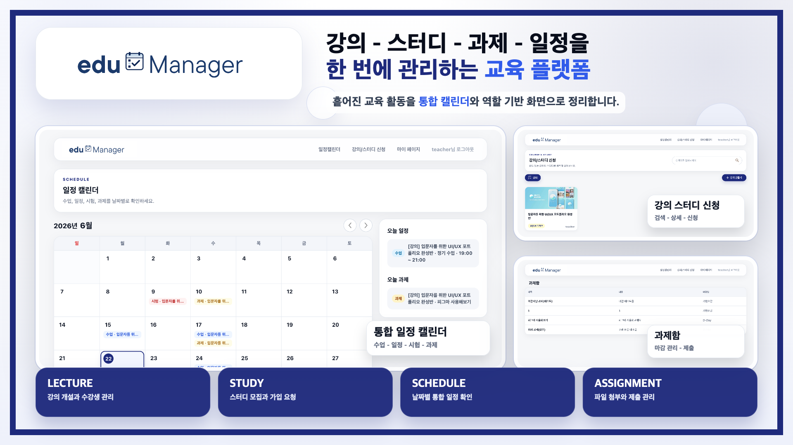
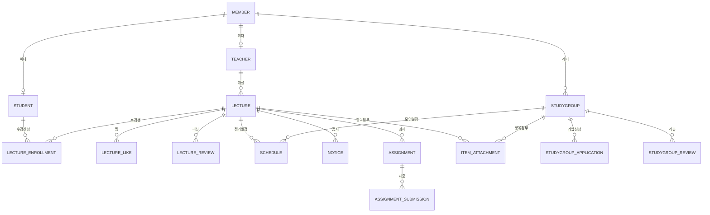

# 📚 EduManager

> ### "흩어진 강의와 스터디, 한 곳에서 관리하다"
>
> 강사는 강의를 열어 일정/공지/과제를 관리하고, 학생은 강의를 신청하고 스터디 그룹을 만들어 함께 공부하는 **교육 관리 웹 플랫폼**입니다.

- **서비스명**: EduManager
- **개발 기간**: 2024.10 ~ 2024.12
- **개발 인원**: 4명 (동덕여자대학교 데이터베이스 프로그래밍 교과 팀 프로젝트)
- **핵심 특징**: 프레임워크 없이 Servlet/JSP + 순수 JDBC로 직접 구현한 계층형 MVC



# 목차

- [프로젝트 개요](#프로젝트-개요)
- [서비스 기획 배경](#서비스-기획-배경)
- [주요 화면 및 기능 소개](#주요-화면-및-기능-소개)
- [프로젝트 핵심 기술](#프로젝트-핵심-기술)
- [시스템 아키텍처](#시스템-아키텍처)
- [ERD](#erd)
- [DB 적용 및 실행](#db-적용-및-실행)
- [디렉토리 구조](#디렉토리-구조)
- [팀원 소개](#팀원-소개)
- [FAQ](#faq)
- [기술 스택](#기술-스택)

# 프로젝트 개요

### 📖 프로젝트 소개

**EduManager**는 강의와 스터디를 한 곳에서 운영하는 **교육 관리 웹 서비스**입니다.
**데이터베이스 프로그래밍** 교과 프로젝트인 만큼, 스프링/마이바티스 같은 프레임워크에 기대지 않고 **관계형 DB 설계와 순수 JDBC**로 웹 백엔드의 동작 원리를 밑바닥부터 구현한 것이 핵심입니다.

### 🎯 핵심 특징

- 👩‍🏫 **강사**: 강의 개설, 정기 수업 일정/공지/과제 등록, 수강생 관리
- 👩‍🎓 **학생**: 강의 검색과 수강 신청, 찜/리뷰, 스터디 그룹 개설과 팀원 모집
- 🗓️ **통합 캘린더**: 수업/스터디/과제/공지 일정을 한 화면에서 확인
- 🗄️ **순수 JDBC**: ORM 없이 PreparedStatement, 트랜잭션, 커넥션 풀을 직접 다룸

# 서비스 기획 배경

강의와 스터디를 운영할 때 필요한 정보는 보통 카카오톡 공지, 엑셀 수강생 명단, 구두 전달처럼 여러 곳에 흩어져 있습니다. 강사는 일정/공지/과제/수강생을 따로따로 관리해야 하고, 학생은 지금 어떤 강의와 스터디가 열려 있는지 한눈에 파악하기 어렵습니다.

- 🧩 **분산된 교육 활동을 하나의 흐름으로**: `강의 모집 → 수강 신청 → 일정/공지/과제 관리 → 스터디 모임`을 한 플랫폼에서 처리
- 🙋 **역할 기반 화면**: 강사와 학생이 각자 역할에 맞는 화면에서 필요한 작업만 빠르게
- 🛠️ **밑바닥부터 구현**: 프레임워크 대신 관계형 DB 설계와 순수 JDBC로 백엔드 동작 원리에 집중

# 주요 화면 및 기능 소개

> 강사 계정으로 로그인해 캡처한 실제 서비스 화면입니다. (네이비 톤 디자인 시스템)

## 🔐 회원 / 인증

<table>
  <tr>
    <th width="33%">로그인</th>
    <th width="33%">회원가입 (역할 선택)</th>
    <th width="33%">내 정보</th>
  </tr>
  <tr>
    <td></td>
    <td></td>
    <td></td>
  </tr>
</table>

- 학생 / 강사 **역할 기반 회원가입**(단계별 입력)과 로그인/로그아웃
- 세션 기반 인증 및 권한별 접근 제어 (예: 강의 개설은 강사만)
- **프로필 사진 업로드** (Oracle BLOB에 저장하고 `/image`로 스트리밍 서빙)
- 아이디 **중복 확인**(AJAX 인라인 검사), 내 정보 수정, **회원 탈퇴(소프트 삭제, 개인정보 익명화)**

## 📚 강의

<table>
  <tr>
    <th width="33%">강의 / 스터디 신청 목록</th>
    <th width="33%">강의 상세</th>
    <th width="33%">강의 개설 (강사)</th>
  </tr>
  <tr>
    <td></td>
    <td></td>
    <td></td>
  </tr>
</table>

- 강사: 강의 **개설/수정**, 정기/단기 수업 일정, 시험, 공지, 과제 등록, 대표 사진 업로드
- 학생: 강의 목록/상세 조회, **수강 신청**, **찜(좋아요)**, **리뷰** 작성
- 일정 충돌 검사 등 강의 운영에 필요한 검증 포함

## 👥 스터디 그룹

<table>
  <tr>
    <th width="50%">스터디 개설</th>
    <th width="50%">스터디 상세 / 가입</th>
  </tr>
  <tr>
    <td></td>
    <td></td>
  </tr>
</table>

- 스터디 **개설/수정**, 모집 인원과 정기 모임 요일 설정
- **가입 신청 → 리더의 수락/거절** 흐름
- 스터디 일정/공지/과제, 첨부파일, 과제 제출, 찜, 리뷰 기능 제공

## 🗓️ 메인 캘린더 / 마이페이지

<table>
  <tr>
    <th width="50%">통합 일정 캘린더</th>
    <th width="50%">마이페이지</th>
  </tr>
  <tr>
    <td></td>
    <td></td>
  </tr>
</table>

- **통합 일정 캘린더**: 수업/일정/시험/과제를 날짜별로 확인하고 항목 클릭 시 상세 페이지로 이동
- 마이페이지: 내 정보 / 내 강의 / 내 스터디 / 찜 목록

## 📢 공지 / 과제 관리 (강사)

<table>
  <tr>
    <th width="33%">공지 등록</th>
    <th width="33%">과제 등록</th>
    <th width="33%">강의 수정</th>
  </tr>
  <tr>
    <td></td>
    <td></td>
    <td></td>
  </tr>
</table>

- 공지/과제/일정 **등록 시 상세 내용, 이미지, 첨부파일** 업로드
- 과제는 시작일/시작시간, 마감일/마감시간을 관리하고 항목별 **수정/삭제** 지원

## 📥 과제함 / 제출 (학생)

<table>
  <tr>
    <th width="33%">과제함 / 마감 관리</th>
    <th width="33%">과제 제출</th>
    <th width="33%">마감 시 제출 차단</th>
  </tr>
  <tr>
    <td></td>
    <td></td>
    <td></td>
  </tr>
</table>

- 과제 **제출**(설명 + 파일 업로드), 과제함에 `D-3` / `기한마감` 자동 표시
- **마감 시간이 지나면 제출 차단** (서버 검증 + UI에서 제출 폼 숨김)
- **제출물 접근 제어**: 강사는 전체 제출물 열람/다운로드, 학생은 **본인 제출물만**

# 프로젝트 핵심 기술

## 🧩 프레임워크 없는 MVC - 프런트 컨트롤러 직접 구현

- 모든 요청을 **`DispatcherServlet`(Front Controller)** 한 곳으로 받고, `RequestMapping`이 URL을 `Controller`로 분기합니다.
- 각 `Controller`는 공통 인터페이스(`execute`)를 구현해 **forward(JSP)** 또는 **redirect** 경로를 반환하고, 디스패처가 이동을 담당합니다.
- 매핑이 없는 요청은 **404**로 처리해, 라우팅 책임을 한 곳에 모았습니다.

## 🗄️ 커넥션 풀 기반 DB 접근 (DBCP2)

- 매 요청마다 커넥션을 새로 만들지 않고 **Apache Commons DBCP2 커넥션 풀**에서 빌려 쓰고 반납합니다.
- `ConnectionManager`(풀 래퍼) → `JDBCUtil`(쿼리 실행/트랜잭션) → `DAO`로 이어지는 데이터 접근 계층을 직접 설계했습니다.
- (트러블슈팅) 요청마다 공유되던 `JDBCUtil` 상태를 **`ThreadLocal`로 격리**해, 동시 접속 시 쿼리가 뒤섞이던 동시성 버그를 제거했습니다.

## 🔒 보안 / 데이터 무결성

- **비밀번호 PBKDF2 해싱**: `PBKDF2WithHmacSHA256`(임의 솔트 + 12만 회 반복)으로 저장하고, 외부 라이브러리 없이 JDK만으로 구현했습니다. 기존 평문 계정은 로그인 시 자동 호환(레거시 폴백) 후 점진 전환됩니다.
- **회원 탈퇴 소프트 삭제 + 익명화**: 물리 삭제 시 강사/스터디 리더를 지우면 타인의 수강/제출 이력까지 연쇄 삭제되거나 고아가 되는 문제가 있어, `status='WITHDRAWN'` 표시 + 개인정보 익명화로 바꿔 **외래키 무결성과 이력을 보존**합니다.
- **권한 기반 접근 제어**(회원 명부/타인 정보는 관리자/본인만, 강의/항목 수정/삭제는 소유 강사/스터디 리더만), **저장형 XSS 방어**(`<c:out>` 이스케이프), **자격증명 분리**(`context.properties` 비추적).

## 🖼️ 이미지 BLOB 저장 / 스트리밍 서빙

- 프로필/강의/스터디 이미지를 파일 시스템이 아닌 **Oracle `BLOB`** 으로 DB에 저장합니다.
- 별도 `IMAGE` 테이블에 `(OWNER_TYPE, OWNER_ID)` 키로 보관하고, `ViewImageController`가 `/image?type=&id=`로 **스트리밍 서빙**합니다(로그인 게이트 + 이미지 MIME 화이트리스트 + `nosniff`).

## 📎 항목 첨부파일 / 과제 제출 관리

- 공지/과제/일정/시험 항목에 첨부파일을 연결하도록 `ITEMATTACHMENT` 테이블을 분리하고, 확장자 허용 목록과 파일 수/용량 제한을 통과한 뒤 BLOB으로 저장합니다.
- 과제 제출물은 `ASSIGNMENTSUBMISSION`에 저장하며, 같은 학생이 다시 제출하면 최신 제출로 교체하고, 다운로드는 수강생/강사, 스터디 멤버/리더 권한을 확인한 뒤 허용합니다.

## 💬 실패 UX - PRG + 세션 Flash 메시지

- 작업 실패 시 `request`가 아닌 **세션**에 메시지를 담고 **redirect**하는 **PRG(Post-Redirect-Get)** 패턴을 적용했습니다.
- 공통 네비게이션이 세션의 `flashError`를 읽어 **한 번만 표시한 뒤 즉시 제거**해, 새로고침 재전송 문제 없이 실패 사유를 전달합니다.

## 🚧 안전한 에러 처리 - 커스텀 404 / 500

- 없는 주소/서버 오류를 톰캣 기본 화면 대신 **네이비 테마 커스텀 에러 페이지**로 응답합니다.
- 예외 스택트레이스(내부 클래스/프레임워크 정보)가 사용자에게 노출되지 않도록 차단했습니다.

# 시스템 아키텍처

프런트 컨트롤러 패턴 기반의 **계층형 MVC** 구조입니다.

```text
User Browser
  └─ Filter (Encoding/Resource)
      └─ DispatcherServlet  (Front Controller)
          └─ RequestMapping  (URL → Controller 매핑)
              └─ Controller   (요청 처리, forward / redirect 결정)
                  └─ Manager  (Service/비즈니스 로직, 싱글톤)
                      └─ DAO → JDBCUtil → ConnectionManager (DBCP2 Pool)
                          └─ Oracle DB
          └─ View : JSP + JSTL   (forward 시 렌더링)
```

**요청 처리 흐름**

1. 모든 요청은 `Filter`(인코딩/정적 리소스)를 거쳐 `DispatcherServlet`으로 진입
2. `RequestMapping`이 URL에 맞는 `Controller`를 찾음 (없으면 404)
3. `Controller` → `Manager` → `DAO` → 커넥션 풀 순으로 DB 작업 수행
4. 결과에 따라 JSP **forward** 또는 **redirect** 반환
5. 실패 시 세션 `flashError` + PRG로 사용자에게 1회성 알림

# ERD

핵심 엔티티 관계 (간략화)



> 프로필/강의/스터디 **이미지**는 별도 `IMAGE` 테이블에 `(OWNER_TYPE, OWNER_ID)` 키 + `IMG_DATA BLOB`으로 저장합니다. 공지/과제/일정/시험 첨부파일은 `ITEMATTACHMENT`, 과제 제출물은 `ASSIGNMENTSUBMISSION`에 BLOB으로 저장합니다.

# DB 적용 및 실행

신규 기능을 반영하려면 기존 기본 스키마에 아래 SQL을 순서대로 적용합니다.

```sql
@db/IMAGE.sql
@db/ALTER_LECTURE_NAME_LENGTH.sql
@db/ALTER_ASSIGNMENT_TIME_COLUMNS.sql
@db/ALTER_SCHEDULE_DESCRIPTION.sql
@db/CREATE_ITEM_ATTACHMENT.sql
@db/CREATE_ASSIGNMENT_SUBMISSION.sql
@db/WIDEN_PWD_FOR_HASH.sql
@db/SOFT_DELETE_MEMBER.sql
@db/MEMBER_DELETE_CASCADE.sql
```

> - `WIDEN_PWD_FOR_HASH.sql` - 비밀번호 해시(PBKDF2) 저장을 위한 `pwd` 컬럼 확대 (미적용 시 신규 회원가입 실패)
> - `SOFT_DELETE_MEMBER.sql` - 회원 탈퇴를 **소프트 삭제 + 익명화**로 전환하기 위한 `MEMBER.status` 컬럼 추가 (미적용 시 로그인/회원목록/탈퇴 쿼리가 `ORA-00904`로 실패)
> - `MEMBER_DELETE_CASCADE.sql` - *(선택)* 과거 하드 삭제용 연쇄정리 트리거. 소프트 삭제 도입으로 더 이상 발화하지 않으며, 관리자가 SQL로 직접 하드 삭제할 때를 대비한 안전망입니다.

DB 접속 정보는 `src/main/resources/context.properties.example`을 복사해 `context.properties`로 작성합니다. 빌드와 배포는 Maven, Tomcat 9로 수행합니다.

```bash
mvn -q -DskipTests package   # target/EduManager.war 생성 후 Tomcat 9에 배포
```

**시연 시나리오**

1. 강사 로그인 → 강의 개설(대표 이미지 업로드) → 정기 수업 일정/공지/과제 등록
2. 학생 로그인 → 강의/스터디 신청 목록에서 수강 신청 → 과제 상세에서 파일/설명 제출
3. 메인 캘린더에서 항목 클릭 → 상세 페이지 이동, 마감 지난 과제는 제출 차단 확인
4. 권한 없는 사용자의 수정 페이지 접근과 파일 다운로드 차단 확인

# 디렉토리 구조

```text
📦 EduManager
├── 📂 db/                         # DB 스키마 / DDL (IMAGE, 첨부, 제출, 소프트삭제 등)
├── 📄 pom.xml                     # Maven 의존성 / 빌드 설정
└── 📂 src/main
    ├── 📂 java
    │   ├── 📂 controller          # 프런트 컨트롤러 + 도메인별 Controller
    │   │   ├── 📄 DispatcherServlet.java   # 진입점 (Front Controller)
    │   │   ├── 📄 RequestMapping.java       # URL → Controller 매핑
    │   │   └── 📂 lecture / study / member / mypage / main
    │   ├── 📂 filter              # EncodingFilter, ResourceFilter
    │   └── 📂 model
    │       ├── 📂 domain          # 도메인 객체 (lecture / study / member / calendar)
    │       ├── 📂 service         # Manager 비즈니스 로직 (lecture / study / member)
    │       └── 📂 dao             # DAO + JDBCUtil + ConnectionManager (lecture / study / member)
    └── 📂 webapp
        ├── 📂 css / js / images   # 정적 리소스 (네이비 디자인 시스템)
        └── 📂 WEB-INF
            ├── 📄 web.xml         # 서블릿 / 필터 / 에러 페이지 매핑
            ├── 📄 error.jsp       # 커스텀 404 / 500 페이지
            └── 📂 navigation / lecture / study / member / mypage / main / registration / item
```

> 세 계층(controller / dao / domain / service) 모두 **lecture / study / member** 도메인으로 일관되게 분리되어 있습니다.

# 팀원 소개

<table>
  <tr>
    <td align="center" width="160">
      <a href="https://github.com/sondahyun"><br/><b>손다현</b></a><br/>
      <sub>@sondahyun</sub>
    </td>
    <td align="center" width="160">
      <a href="https://github.com/heessunny"><br/><b>김희선</b></a><br/>
      <sub>@heessunny</sub>
    </td>
    <td align="center" width="160">
      <a href="https://github.com/JoEunHyang"><br/><b>조은향</b></a><br/>
      <sub>@JoEunHyang</sub>
    </td>
    <td align="center" width="160">
      <a href="https://github.com/zzinggny"><br/><b>zzinggny</b></a><br/>
      <sub>@zzinggny</sub>
    </td>
  </tr>
</table>

# FAQ

- **Q. 스프링을 쓰지 않은 이유는?**
  - A. 데이터베이스 프로그래밍 교과 프로젝트로, 프레임워크가 감춰주는 요청 분기/트랜잭션/커넥션 관리를 **직접 구현**하며 동작 원리를 익히는 데 목적을 뒀습니다.
- **Q. 이미지와 첨부파일은 어디에 저장되나요?**
  - A. 파일 시스템이 아니라 **Oracle BLOB**에 저장하고 `/image`로 스트리밍 서빙합니다. (프로필/강의/스터디 이미지, 항목 첨부파일, 과제 제출물)
- **Q. 회원 탈퇴하면 데이터가 사라지나요?**
  - A. **소프트 삭제**라 행은 보존하고 개인정보만 익명화합니다. 수강/제출/후기 등 이력과 외래키 무결성은 유지되며, 작성자는 "(탈퇴회원)"으로 표기됩니다.
- **Q. 로컬에서 실행하려면?**
  - A. `db/`의 SQL을 순서대로 적용하고 `context.properties`를 작성한 뒤 `mvn package`로 빌드해 Tomcat 9에 배포합니다.

# 기술 스택

### Language / View

<div>
  
  
  
</div>

### Web / DB

<div>
  
  
  
  
  
</div>

### Build / Etc.

<div>
  
  
  
  
  
</div>

<br/>

<div align="center">

**Created by Team EduManager** 📚

</div>
